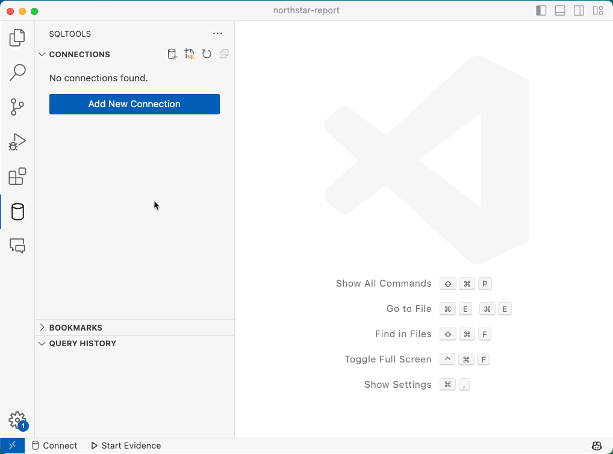
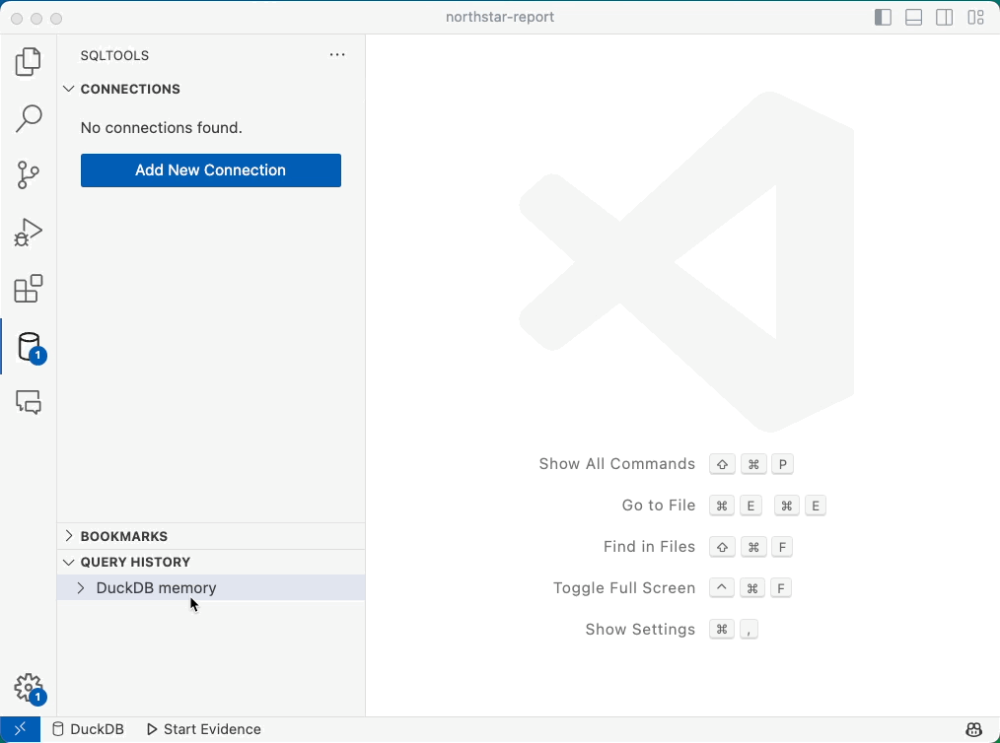
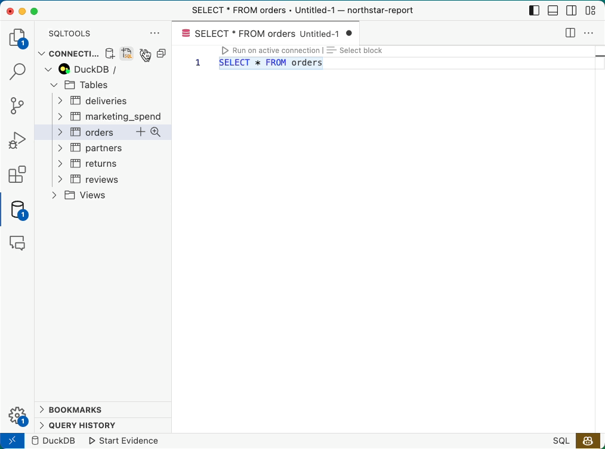
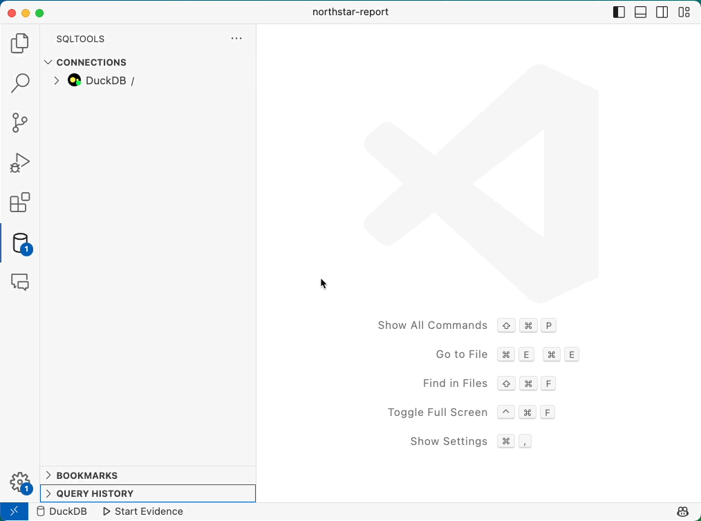
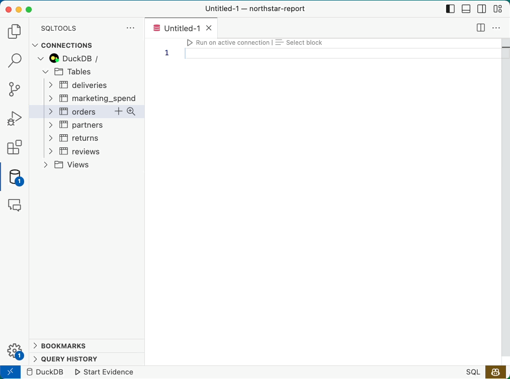

#  SQLTools DuckDB Driver 

## Latest DuckDB Support: v0.8.1

A Visual Studio Code extension which extends [SQLTools](https://marketplace.visualstudio.com/items?itemName=mtxr.sqltools), with a driver for DuckDB.

This driver is maintained by [Evidence](https://evidence.dev): an open source BI tool to publish reports with SQL and Markdown.

## Features

- Latest DuckDB support (currently 0.8.1)
- **Connect** to a local or in memory DuckDB instance
- **Run queries** against a DuckDB instance
- **Explore DB** tables and columns in the sidebar
- **View** table results by selecting them in the sidebar
- **Autocomplete** for common keywords (e.g. SELECT, FROM, WHERE) and table names

### Connect Local and In-Memory DBs

### Run Query

### Explore DB

### Autocomplete

## Contributing

- If you encounter bugs or have feature requests, feel free to open an issue.
- PRs welcome

### Maintained by 
